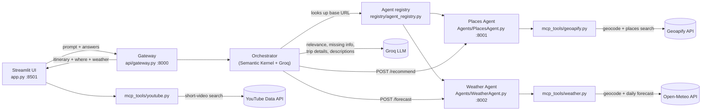

# AI Travel Planner

Describe your trip in plain English, answer a couple of quick follow-up
questions, and get a real, day-by-day itinerary — complete with places,
short descriptions, suggested times, and a numbered map.

## How it works

The app is four small services that talk to each other over HTTP:

| Service | Default port | File | Role |
|---|---|---|---|
| Streamlit UI | 8501 | `src/travel_planner/app.py` | Chat-style front end |
| Gateway | 8000 | `src/travel_planner/api/gateway.py` | API the UI talks to |
| Places Agent | 8001 | `src/travel_planner/Agents/PlacesAgent.py` | Finds real places via Geoapify |
| Weather Agent | 8002 | `src/travel_planner/Agents/WeatherAgent.py` | Daily forecast via Open-Meteo |

Request flow:

1. The UI sends the user's prompt to the gateway's `/generate-questions`.
2. The gateway's orchestrator (Semantic Kernel + Groq) checks the prompt is
   travel-related, extracts what it can (destination, dates, duration,
   interests), and — if anything important is missing — returns follow-up
   questions.
3. The UI shows those questions with quick-reply suggestion chips
   (multi-select for interests).
4. Once answered, the UI calls `/generate-itinerary`. The gateway asks the
   Places Agent and Weather Agent (in parallel) for points of interest and a
   daily forecast for the destination, schedules the places across the
   trip's days and time slots, asks the LLM for a short description of each
   stop, and returns the itinerary, destination, and weather forecast.
5. The UI renders a trip header (destination + date range), then the
   itinerary as day-grouped cards — each day's header shows the full date
   and that day's forecast — plus a map where each pin is numbered to match
   the corresponding card, and a row of trending short videos for the
   destination.

### Agents and MCP-style tools

The Orchestrator is the only thing that talks to the LLM. The Places and
Weather agents are plain FastAPI services it calls over HTTP (found via the
agent registry); each agent wraps its external API as a small "MCP tool"
module that returns `[]`/raises on failure so a bad call degrades
gracefully instead of breaking the whole itinerary.



## Setup

1. Python 3.10+
2. Install dependencies:

   ```powershell
   pip install -r Requirements.txt
   ```

3. Create a `.env` file in the project root with your API keys:

   ```
   GROQ_API_KEY=your_groq_key
   GEOAPIFY_API_KEY=your_geoapify_key

   # Optional — enables the "Trending in <city>" reels row. Without it, the
   # UI falls back to a static demo set (Milan only).
   YOUTUBE_API_KEY=your_youtube_data_api_key
   ```

   The Weather Agent uses [Open-Meteo](https://open-meteo.com/), which is
   free and requires no API key.

## Running it

Start each service in its own terminal from the project root (PowerShell):

```powershell
$env:PYTHONPATH = "src"
python -m uvicorn travel_planner.Agents.PlacesAgent:app --port 8001
```

```powershell
$env:PYTHONPATH = "src"
python -m uvicorn travel_planner.Agents.WeatherAgent:app --port 8002
```

```powershell
$env:PYTHONPATH = "src"
python -m uvicorn travel_planner.api.gateway:app --port 8000
```

```powershell
$env:PYTHONPATH = "src"
python -m streamlit run src/travel_planner/app.py
```

Then open http://localhost:8501.

## Features

- Natural-language trip prompts, e.g. *"I want a 3-day romantic trip to
  Paris with museums and food"*
- Follow-up questions with quick-reply chips (multi-select for interests,
  toggle on/off)
- A trip header showing the destination and date range, e.g. "🌍 Lisbon
  Trip, June 15-16, 2026"
- Day-by-day itinerary, each day headed by its full date (e.g. "Day 1 -
  Monday, June 15") and a weather summary for that day
- Real points of interest from Geoapify, matched to the requested interests
- Short, AI-written description for each stop
- Numbered map of all stops, matching the numbers on the itinerary cards
- A row of trending short videos for the destination ("Trending in
  &lt;city&gt;"), pulled live from YouTube

## Project layout

- `src/travel_planner/Agents/Orchestrator.py` — planning pipeline
  (relevance → missing info → follow-up questions / trip details), then
  calls the Places and Weather agents in parallel
- `src/travel_planner/Agents/PlacesAgent.py` — Geoapify-backed
  recommendations, day/time scheduling, and place descriptions
- `src/travel_planner/Agents/WeatherAgent.py` — Open-Meteo-backed daily
  forecast for the trip's dates
- `src/travel_planner/mcp_tools/geoapify.py` — Geoapify API wrappers and
  interest → category mapping
- `src/travel_planner/mcp_tools/weather.py` — Open-Meteo geocoding +
  forecast wrappers and WMO weather-code → emoji/label mapping
- `src/travel_planner/mcp_tools/youtube.py` — YouTube Data API wrapper for
  short-video search
- `src/travel_planner/UI/reels_demo.py` — renders the "Trending in
  &lt;city&gt;" reels row
- `src/travel_planner/registry/agent_registry.py` — maps agent name → base
  URL
- `src/travel_planner/models/` — Pydantic models shared across services
- `src/travel_planner/UI/` — Streamlit styling and UI components
- `prompts.yaml` — LLM prompt templates for each pipeline stage

## Author

Travel_planner was created in 2026 by Mohammadali Amiri. Built with
[Cookiecutter](https://github.com/cookiecutter/cookiecutter) and the
[audreyfeldroy/cookiecutter-pypackage](https://github.com/audreyfeldroy/cookiecutter-pypackage)
project template.
